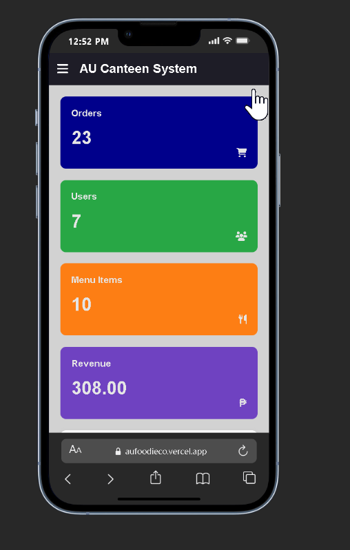
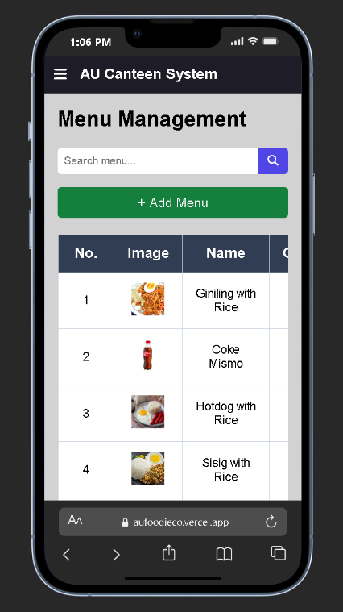

# AUfoodieco: Self-Service Canteen Ordering System

AUfoodieco is a self-service canteen ordering system developed for **Arellano University Juan Sumulong Campus**. It replaces slow manual queuing with a fast, touch-based ordering experience inspired by modern fast-food kiosks.

---

## Features

### Menu and Ordering

* Browse and filter menu items
* Add to cart with real-time total
* Search functionality

### Order Management (Staff)

* View and update order status
* Monitor orders in real-time

### Authentication

* Login and Register
* Guest access (no session persistence)

### Customer Features

* Order food and manage cart
* Checkout with multiple payment methods
* Track orders in real-time
* View history, receipts, and profile
* Wallet system with expense tracking

### Admin Features

* Dashboard with analytics
* User, menu, and order management (CRUD)
* Revenue and order monitoring

---

## Technology Stack

* HTML
* CSS
* JavaScript (Vanilla)
* LocalStorage
* Firebase (planned)

---

## Project Structure

```
aufoodieco/
├── css/
├── data/
│   ├── complaint.json
│   ├── global.json
│   ├── help.json
│   ├── identity.json
│   └── recommend.json
├── imgs/
├── pages/
│   ├── admin/
│   │   ├── dashboard.html
│   │   ├── menu-management.html
│   │   ├── order-history.html
│   │   ├── order-management.html
│   │   └── user-management.html
│   ├── developers.html
│   ├── features.html
│   ├── homepage.html
│   ├── orders.html
│   ├── profile.html
│   └── wallet.html
├── script/
│   ├── admin/
│   ├── config/
│   └── modules/
│       ├── ai/
│       ├── api/
│       ├── auth/
│       ├── cart/
│       ├── food/
│       ├── lib/
│       ├── profile/
│       ├── utils/
│       └── wallet/
├── app.js
├── main.js
├── index.html
├── README.md
├── robots.txt
└── sitemap.xml
```

---

## User Flow

### Customer Flow

1. Login / Register / Guest
2. Browse menu and add to cart
3. Checkout and select payment
4. Track orders
5. View history and manage profile

### Admin Flow

1. Login to dashboard
2. Monitor and update orders
3. Manage users and menu
4. View reports and analytics

---

* HTML
* CSS
* JavaScript (Vanilla)
* LocalStorage (for simulation of cart, orders, and sessions)
* Firebase (planned for real-time database integration)

---

## User Flow

### Customer Flow

1. Login / Register / Continue as Guest
2. Browse homepage and menu
3. Add items to cart
4. Review cart and total
5. Checkout and select payment method
6. Track order status in real-time
7. View order history and receipts
8. Manage profile and wallet
9. Analyze spending via charts

### Admin Flow

1. Login to admin dashboard
2. Monitor incoming orders
3. Update order status
4. Manage users (CRUD)
5. Manage menu items (CRUD)
6. View order history
7. Analyze revenue and order trends

---

## Demo

* 🌐 Live Prototype: [https://aufoodieco.vercel.app](https://aufoodieco.vercel.app)
* 🎨 Figma Design: [https://www.figma.com/proto/bIIH4QvtG49f72s6JJvDm2/HCI---UI-DESIGN](https://www.figma.com/proto/bIIH4QvtG49f72s6JJvDm2/HCI---UI-DESIGN)

---

## Page Overview

### 1. Login Page

* Users can log in, register, or continue as a guest (guest session is not persisted)
  

### 2. Register Page

* Allows new users to create an account
  

### 3. System Features Page

* Displays system highlights and key functionalities
  

### 4. User Homepage / Ordering Page

* Main interface for browsing food and adding items to cart
  

### 5. FoodieROI AI Recommendation

* Shows AI-based recommended food items
  

### 6. Review Order & Payment Selection

* Users review cart and choose payment method (GCash or Pay on Counter)
  

### 7. GCash QR Payment

* Displays QR code for GCash payment transactions
  

### 8. User Order Monitoring Page

* Displays order status sections: New, Preparing, Ready
  

### 9. Wallet Page

* Includes wallet balance, cash-in, QR scanner, expense tracking, and payment history
  

### 10. Payment History / Digital Receipt

* Shows transaction history with downloadable receipts (PDF/JPG)
  

### 11. User Profile Page

* Displays and allows editing of user basic information
  

### 12. Admin Dashboard

* Overview of orders, users, revenue, and analytics charts
  

### 13. Admin Orders Page

* Admin can monitor and update order statuses
  

### 14. Admin User Management

* Manage users with CRUD operations
  

### 15. Menu Management

* Manage menu items with CRUD functionality
  

### 16. Order History Management

* Manage and review completed orders
  

### 17. Mobile Responsive View (1)

* Mobile layout adaptation of the system
  

### 18. Mobile Responsive View (2)

* Continued mobile responsiveness showcase
  

### 19. Mobile Responsive View (3)

* Additional mobile interface screens
  

### 20. Mobile Responsive View (4)

* Further mobile UI adjustments
  


## Contributors

* AUfoodieco Team – Arellano University Juan Sumulong Campus
